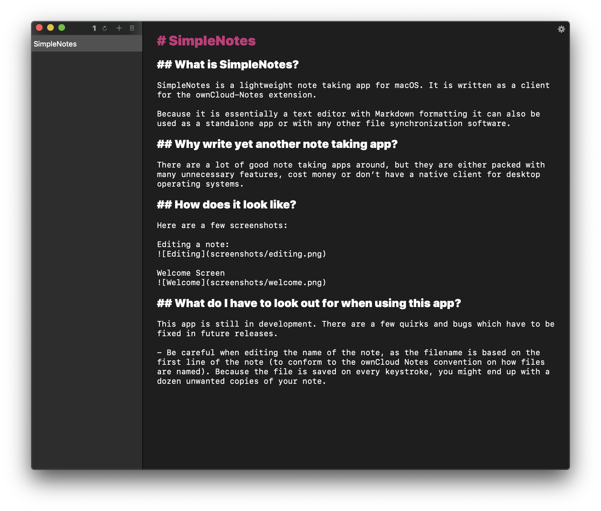

# SimpleNotes

## What is SimpleNotes?

SimpleNotes is a lightweight note taking app for macOS. It is written as a client for the ownCloud-Notes extension.

Because it is essentially a text editor with Markdown formatting it can also be used as a standalone app or with any other file synchronization software.

## Why write yet another note taking app?

There are a lot of good note taking apps around, but they are either packed with many unnecessary features, cost money or don’t have a native client for desktop operating systems.

## How does it look like?

Here are a few screenshots:

Editing a note:

Welcome Screen

## What do I have to look out for when using this app?

This app is still in development. There are a few quirks and bugs which have to be fixed in future releases.

- Be careful when editing the name of the note, as the filename is based on the first line of the note (to conform to the ownCloud Notes convention on how files are named). Because the file is saved on every keystroke, you might end up with a dozen unwanted copies of your note.

## Can I modify and redistribute this app?

Yes, this app is licensed under the BSD-2-Clause license, which you can find in the [LICENSE file](./LICENSE)
